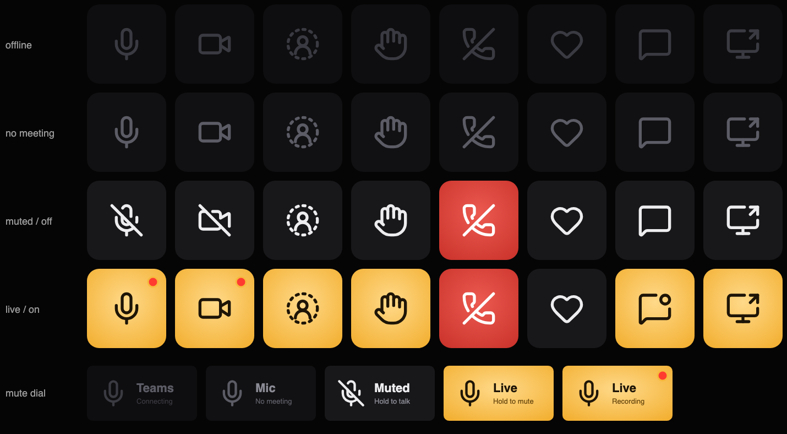

# Tally for Teams

Live Microsoft Teams meeting controls for Stream Deck on Mac. A lit key means it's live.



**Why "Tally"?** On a TV set, the tally light is the small red lamp on a camera that tells everyone it's live. Tally puts that light on your Stream Deck: a lit key means that thing is live — your mic, your camera, your raised hand, your shared screen.

## Install

Download [Tally.streamDeckPlugin](https://github.com/mpalermiti/tally-for-teams/releases/latest/download/Tally.streamDeckPlugin) and double-click it.

Requires macOS 13+, Stream Deck 7.1+, and the new Teams desktop app (not Teams on the web).

Tally works while Teams is in the background.

## Allow Accessibility

Microsoft retired Teams' local control API on June 30, 2026, with no replacement. Tally uses macOS Accessibility, the same system a screen reader uses, to find and press Teams' meeting buttons.

When you press a key, macOS asks to let **Stream Deck** control your computer. Turn it on in System Settings → Privacy & Security → Accessibility. It says **Stream Deck** because that app runs plugins.

Until access is on, keys stay dimmed and the dial says *Allow / Accessibility*.

Tally reads meeting buttons: their labels and styling. It never reads messages, chat, people's names, or window titles. There is no cloud service, account, or Graph permission involved.

## Keys

One rule: a lit key means it's live. Warm = your mic is hot, camera is on, your hand is up, or you're sharing. Dark = off. Dimmed = not in a meeting, or that control isn't available right now (dimmer still = Teams isn't readable). Leave turns red during a meeting.

Tested with Teams 26267.1701.5163.3395.

| Key | Press | Lit when |
|---|---|---|
| Mute | toggle mic (also a Stream Deck+ dial, see below) | mic is live |
| Camera | toggle camera | camera is on |
| Leave | leave the meeting (optionally only on a hold) | (red during a meeting) |
| Chat | open / close meeting chat | — |
| Share | open the share tray; while presenting, stop sharing | sharing |
| React | send the chosen reaction (Like, Love, Applause, Laugh, Wow) via the React menu | — |
| Raise hand | raise / lower via the React menu | hand is up |

**Leave:** turn on *Hold to leave* in its settings so a tap can't hang up. Hold for about half a second; a ring fills, then you leave. (In a Multi Action, Leave still acts at once.)

### Stream Deck+ dial

Put **Mute** on a dial and its strip shows a large **Live** or **Muted**, with what holding will do.

- **Tap** the dial: toggle mute.
- **Hold** the dial: flip the mic only while held. Muted, it's push-to-talk; live, it's a cough button.
- **Turn right** to unmute, **left** to mute. Turning toward the state you're already in does nothing.
- **Touch** the strip: toggle mute.

## Updating

Download the latest release again and double-click it.

To hear about new releases, watch the repo → Custom → Releases.

## If a key stops working

Teams probably changed its interface. [Open an issue](https://github.com/mpalermiti/tally-for-teams/issues/new/choose) using the form.

## How it works

```
Stream Deck ──▶ plugin (Node, src/)  ──stdin/stdout JSON──▶  teams-bridge (Swift, bridge/)  ──Accessibility──▶ Teams
                 knows what buttons mean                        finds buttons by web id, reads
                 (src/teams/selectors.ts)                       labels and styles, presses them
```

- **Finding the controls:** Teams exposes its accessibility tree only to assistive tech, so the helper sets the same switch VoiceOver does (`AXEnhancedUserInterface`) while it runs, and turns it off when it quits.
- **One window at a time:** a meeting can have a full window and a compact view that swap in and out. The helper takes every button from the one window holding the mic button and the most of the others, so the two toolbars are never mixed.
- **Keeping up with state:** it finds the toolbar buttons once, then re-reads just those every half second (about 0 ms). A full rescan (50–450 ms) happens within 2 s of any watched button going stale (Teams rebuilds the toolbar when sharing starts), and every 10 s in a meeting.
- **State Teams only shows as styling:** a raised hand keeps React's label; only its look changes. The plugin compares React with the plain toolbar buttons instead of matching Teams' generated class names, which change between builds.
- **When Teams changes its interface:** button ids and label rules all live in `src/teams/selectors.ts`. The probes show what the current Teams exposes: `teams-ax-probe.swift` lists the toolbar, and `teams-ax-diff.swift` prints what changes as you do something.

## Development

Building requires Node.js and Apple's command-line tools (`xcode-select --install`) to compile the Accessibility helper.

Build from source:

```bash
npm install
npm run pack                    # builds ai.michaelp.tally.streamDeckPlugin; double-click to install
npm run build && npm run link    # development install; needs the Elgato CLI: npm i -g @elgato/cli
```

Useful scripts:

```bash
npm test                # unit tests: selectors, bridge process handling, key/dial visuals, dial gestures
npm run typecheck
npm run build           # compiles bin/teams-bridge (Swift) and bundles bin/plugin.js
npm run smoke           # end-to-end: the built plugin against a fake Stream Deck + scripted bridge
npm run smoke:package   # package smoke: unzips the packed plugin and starts its real helper
npm run watch           # rebuild + restart the plugin in Stream Deck on save
npm run icons           # regenerate glyphs.ts and every PNG after design changes
npm run sheet -- out.png   # render all keys in all states to one image
```

CI (`.github/workflows/build.yml`) builds, tests, and packs on pushes to `main`, pull requests, and version tags; docs-only changes are skipped. Pushing a tag `vX.Y.Z` matching `package.json` and `manifest.json`, checked by `npm run version:check`, publishes a GitHub Release with `Tally.streamDeckPlugin` attached.

### Probing Teams

Probe Teams directly (terminal needs Accessibility permission; run during a meeting):

```bash
swift probe/teams-ax-probe.swift              # list the meeting toolbar's buttons
swift probe/teams-ax-probe.swift --watch      # live mute/camera labels; Ctrl-C to stop
swift probe/teams-ax-probe.swift --press-test # press mute twice (mic blips on, then back)
swift probe/teams-ax-probe.swift --menus      # list what the React / More / video-options menus offer
swift probe/teams-ax-diff.swift --only reaction-menu-button,share-button
                                              # print what changes as you raise a hand, share, …
```

### Code map

```
bridge/TeamsBridge.swift   Accessibility helper: watch ids, press, open-menu-and-press
src/teams/selectors.ts     Teams knowledge: button ids, what labels mean, action → command
src/teams/bridge.ts        runs the helper: status → snapshot, requests, restarts
src/teams/protocol.ts      the meeting model keys render from
src/render/key.ts          meeting state → key visual (pure), and the SVG key design
src/actions/               one class per key; shared behaviour in teams-key.ts, dial gestures in gestures.ts
src/plugin.ts              wiring: start the helper, register keys, redraw on change
```

### Releasing

1. `npm version X.Y.Z --no-git-tag-version` (updates `package.json` and `package-lock.json`), and set `Version` to `X.Y.Z.0` in `ai.michaelp.tally.sdPlugin/manifest.json`.
2. `npm run version:check`.
3. Commit the bump.
4. `git tag vX.Y.Z`.
5. `git push && git push origin vX.Y.Z`.

Pre-release tags like `v1.1.0-rc.1` publish pre-releases; for those, the npm version is `X.Y.Z-rc.N` and the manifest stays `X.Y.Z.0`.

## Notes

- **Privacy:** the helper only reads buttons, toggles, and menu items (their labels and styling), never messages, chat rows, people's names, or window titles. Menu items are matched only if they appeared after the plugin opened the menu, so a chat message's "Like" can never be pressed.
- **Limits:** it can only use what Teams shows on screen, so it can't join meetings, set presence, or read your calendar. A Teams interface update can break a button until `selectors.ts` is updated.
- **Glyphs:** from [Lucide](https://lucide.dev) (ISC; parts MIT); `wow` is custom on the same grid. License in [`ai.michaelp.tally.sdPlugin/lucide.LICENSE.txt`](ai.michaelp.tally.sdPlugin/lucide.LICENSE.txt).
- **Settings pages:** use [sdpi-components](https://sdpi-components.dev) (MIT), which bundles [Lit](https://lit.dev) (BSD-3-Clause); both are shipped with the plugin, with their licenses in [`ai.michaelp.tally.sdPlugin/ui/sdpi-components.LICENSE.txt`](ai.michaelp.tally.sdPlugin/ui/sdpi-components.LICENSE.txt).
- Not affiliated with or endorsed by Microsoft or Elgato. Microsoft Teams is a trademark of Microsoft Corporation.

## License

MIT. See [LICENSE](LICENSE).
