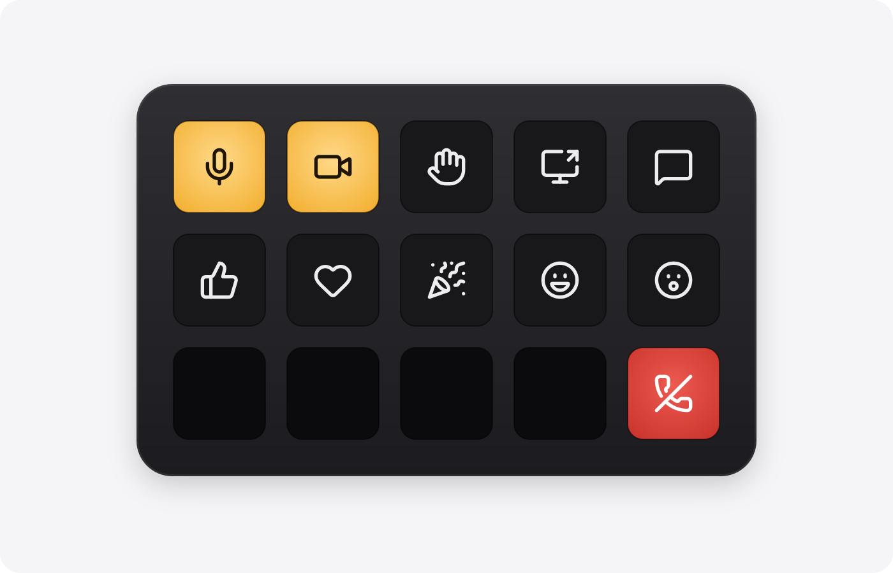

# Tally for Teams

Live Microsoft Teams controls for Stream Deck on Mac.

<b><a href="https://github.com/mpalermiti/tally-for-teams/releases/latest/download/Tally.streamDeckPlugin">Download Tally</a></b> · macOS 13+ · Stream Deck 7.1+ · the new Teams desktop app · full state in English Teams

**See it at a glance.** Keys light while your mic is live, your camera's on, your hand is up, or you're sharing. A red dot means the meeting is being recorded. If Tally can't read something, it doesn't guess.

**Push to talk on any key.** Tap Mute to toggle. Hold it to talk while muted, or to cough while live.

**Stays out of your way.** Works with Teams in the background and never pulls it to the front.

**No accidental hang-ups.** Leave can need a hold, so a stray tap can't end your meeting. It's on in the bundled profiles.

**One-click setup.** Stream Deck offers a ready-made Tally profile for Stream Deck and Stream Deck + when you install.

**Private by design.** Runs entirely on your Mac. No account, no cloud. It reads only Teams' meeting controls and status.

**Why "Tally"?** On a TV set, the tally light is the small red lamp on a camera that tells everyone it's live. Tally puts that light on your Stream Deck: a lit key means that thing is live — your mic, your camera, your raised hand, your shared screen.

## The keys

| Key | Press | Lit when |
|---|---|---|
| Mute | tap to toggle; hold to talk while muted or cough while live | your mic is live; red dot while recorded or transcribed |
| Camera | toggle your camera | your camera is on; red dot while recorded or transcribed |
| Raise hand | raise or lower your hand | your hand is up |
| Share | open the share tray; while presenting, stop sharing | you're sharing |
| Chat | open or close meeting chat | — |
| React | send Like, Love, Applause, Laugh or Wow (pick in its settings) | — |
| People | open or close the participant list | — |
| Background blur | blur or unblur your background | — |
| Meeting timer | glance at elapsed meeting time | shows time in the meeting |
| Leave | leave the meeting; optionally only when held | red during a meeting |

Keys dim when there's nothing to do: no meeting, or that control isn't available right now.

On a **Stream Deck+**, put Mute on a dial: tap to toggle, hold to talk, turn right to unmute and left to mute.

## Set up

1. [Download Tally](https://github.com/mpalermiti/tally-for-teams/releases/latest/download/Tally.streamDeckPlugin) and double-click it.
2. Accept the bundled **Tally (Stream Deck)** or **Tally (Stream Deck +)** profile, or drag the keys you want from **Tally for Teams**. Bundled Leave keys already use *Hold to leave*; keys you drag in yourself can turn it on in settings. (In a Multi Action, Leave still acts at once.)
3. Press any Tally key. macOS asks to let **Stream Deck** control your computer: turn it on in System Settings → Privacy & Security → Accessibility. (Teams no longer offers a control API, so Tally works the way a screen reader does.) Until it's on, keys stay dark and a Stream Deck+ dial says *Allow / Accessibility*.

Optional: on Stream Deck or Stream Deck +, in any Tally key's settings, turn on *Switch to the Tally profile during meetings*. Tally switches to the bundled profile when a meeting starts and switches back after it ends.

**Updating:** download the latest release and double-click it; your keys stay put. To hear about new versions, watch this repo → Custom → Releases.

**If a key stops working:** Teams probably changed its interface. Tally shows a small `?` on keys and *Teams changed* on the Stream Deck+ dial when it can see a meeting but not the controls it expects. [Open an issue](https://github.com/mpalermiti/tally-for-teams/issues/new/choose), or see [DEVELOPMENT.md](DEVELOPMENT.md#fixing-tally-when-teams-changes) for the editable selectors file.

## Notes

- **Privacy:** the helper reads meeting buttons (their labels, styling, and whether they're enabled), the meeting's status (recording, elapsed time), and items of menus it opens, the way a screen reader does. It never reads messages, chat, or window titles. It logs menu controls by id only. Menu items are matched only if they appeared after the plugin opened the menu, so a chat message's "Like" can never be pressed.
- **Limits:** it can only use what Teams shows on screen, so it can't join meetings, set presence, or read your calendar. Hand, reactions and Background blur use Teams' menus, which close only in the meeting window. If you last clicked Teams' main window, those keys show an alert until you click the meeting window once; Mute, Camera, Leave and the rest work either way. In other languages, Mute, Camera, Raise hand, React, Share, Chat, People, and Leave still press by web id. Mute tap toggles, and holding Mute still ends where it started. Lit state, Background blur, and the Stream Deck + dial need English Teams or a [`selectors.json`](DEVELOPMENT.md#fixing-tally-when-teams-changes) override.
- **Glyphs:** from [Lucide](https://lucide.dev) (ISC; parts MIT); `wow` is custom on the same grid. License in [`ai.michaelp.tally.sdPlugin/lucide.LICENSE.txt`](ai.michaelp.tally.sdPlugin/lucide.LICENSE.txt).
- **Settings pages:** use [sdpi-components](https://sdpi-components.dev) (MIT), which bundles [Lit](https://lit.dev) (BSD-3-Clause); both are shipped with the plugin, with their licenses in [`ai.michaelp.tally.sdPlugin/ui/sdpi-components.LICENSE.txt`](ai.michaelp.tally.sdPlugin/ui/sdpi-components.LICENSE.txt).
- **Bundled code:** licenses for the npm packages bundled into the plugin are in [`ai.michaelp.tally.sdPlugin/third-party-licenses.txt`](ai.michaelp.tally.sdPlugin/third-party-licenses.txt).
- Not affiliated with or endorsed by Microsoft or Elgato. Microsoft Teams is a trademark of Microsoft Corporation.

Building from source and how it works: [DEVELOPMENT.md](DEVELOPMENT.md). License: MIT ([LICENSE](LICENSE)).
